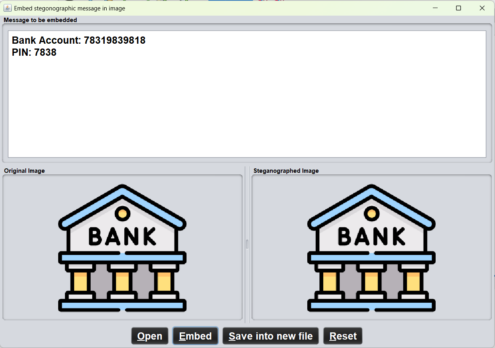
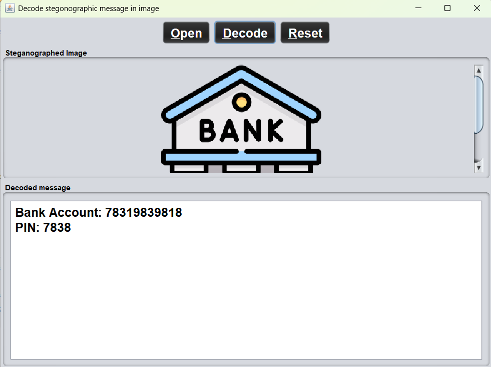

# 🔒 Secure Data Hiding in Image Using Steganography  

## 📌 Overview  
This project implements **steganography** using the **Least Significant Bit (LSB)** technique to securely hide secret messages within images. The hidden data can later be extracted without altering the image’s visual quality.  

## 🎯 Features  
✅ **Secure Message Embedding** – Hide text inside an image without noticeable changes.  
✅ **LSB Technique** – Uses the least significant bit of each pixel to store data.  
✅ **Easy Retrieval** – Extract and decode the hidden message from the modified image.  
✅ **User-Friendly Interface** – Simple GUI for embedding and decoding messages.  

## 🛠 Technologies Used  
- **Java** – Core programming language  
- **Swing (JFrame, JButton, JTextArea)** – For GUI  
- **BufferedImage & File Handling** – For image processing  
- **LSB Algorithm** – To embed and extract messages  

## 🚀 How It Works  
### **1. Encoding (Hiding the Message)**  
1. **Select an image** via GUI.  
2. **Enter a secret message** to hide.  
3. **Embed the message** using LSB manipulation.  
4. **Save the steganographed image** with the hidden data.  

### **2. Decoding (Extracting the Message)**  
1. **Load the steganographed image** through the GUI.  
2. **Read the embedded data** using LSB extraction.  
3. **Display the hidden message** in the GUI.  

## 📸 Screenshots  
### **1️⃣ Encoding Phase**  
  

### **2️⃣ Decoding Phase**  
  

## 🔧 Setup & Usage  
1️⃣ **Clone the Repository**  
```sh
git clone https://github.com/Rakesh0045/Edunet-CyberSecurity-Project.git
cd Edunet-CyberSecurity-Project
```

2️⃣ **Run the Application**  
- Open the project in any Java IDE (Eclipse/IntelliJ/NetBeans).  


## 🌍 Future Enhancements  
- 🔐 **AES Encryption** – Add encryption for stronger security.  
- 📈 **Optimized Storage** – Improve LSB algorithm for better efficiency.  

## 📝 License  
This project is open-source under the **MIT License**.  

 

